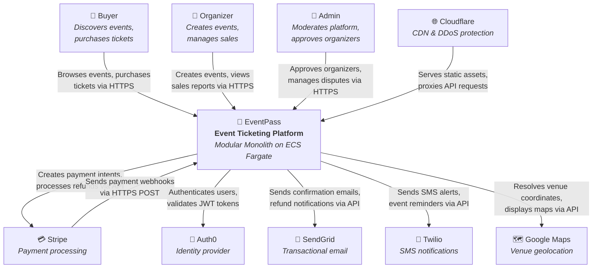

# System Context Diagram (C4 Level 1)

## Overview

This diagram shows EventPass as a single system (black box) and its relationships with human actors and external systems. Internal components are intentionally hidden — the goal is to communicate **what** EventPass interacts with and **why**, not how it works internally.

## Diagram

## Explanation

**EventPass** sits at the center of the diagram as a single deployable system — a Modular Monolith running on AWS ECS Fargate (ADR-001, ADR-009). It exposes a REST API (ADR-007) consumed by three types of human actors through a Next.js frontend (ADR-010):

- **Buyers** interact with EventPass to discover events (via the Catalog module), purchase tickets (via Ticketing and Orders modules), and view their order history. This is the highest-traffic interaction, peaking at ~5K concurrent users during flash sales.
- **Organizers** create and manage events (via Event Management module), configure ticket types and pricing (via Ticketing module), and view sales dashboards. They must be verified by an admin before they can publish events.
- **Admins** moderate the platform through an internal admin panel, approving organizer verifications, managing disputes, and monitoring system metrics.

**External systems** provide capabilities that EventPass delegates rather than building in-house:

- **Stripe** handles all financial operations — payment intents, charges, refunds, and organizer payouts. EventPass receives payment confirmations via Stripe webhooks (HTTPS POST to `/webhooks/stripe`). The Payment module wraps Stripe behind an Anti-Corruption Layer (ACL).
- **Auth0** manages user authentication — registration, login, JWT token issuance, and MFA (ADR-005). EventPass validates JWT tokens on every API request and reads user roles (BUYER, ORGANIZER, ADMIN) from token claims.
- **SendGrid** delivers transactional emails — order confirmations with QR codes, refund notifications, organizer approval/rejection emails, and event reminders. The Notification module consumes domain events and translates them into SendGrid API calls.
- **Twilio** sends SMS notifications — ticket purchase confirmations, event reminders, and critical alerts. Used as a secondary notification channel alongside email.
- **Google Maps** provides venue geolocation — latitude/longitude resolution for venue addresses and embeddable maps on event detail pages.
- **Cloudflare** serves as the CDN and security layer — caches static assets (images, JavaScript bundles), provides DDoS protection, and proxies API requests to the ECS-hosted backend.

### Key Observation

All external system integrations are isolated behind Anti-Corruption Layers within their respective bounded contexts. Replacing any external provider (e.g., switching from Stripe to Adyen, or from SendGrid to AWS SES) would require changes only in the specific module's infrastructure adapter — no other part of the system is affected.
