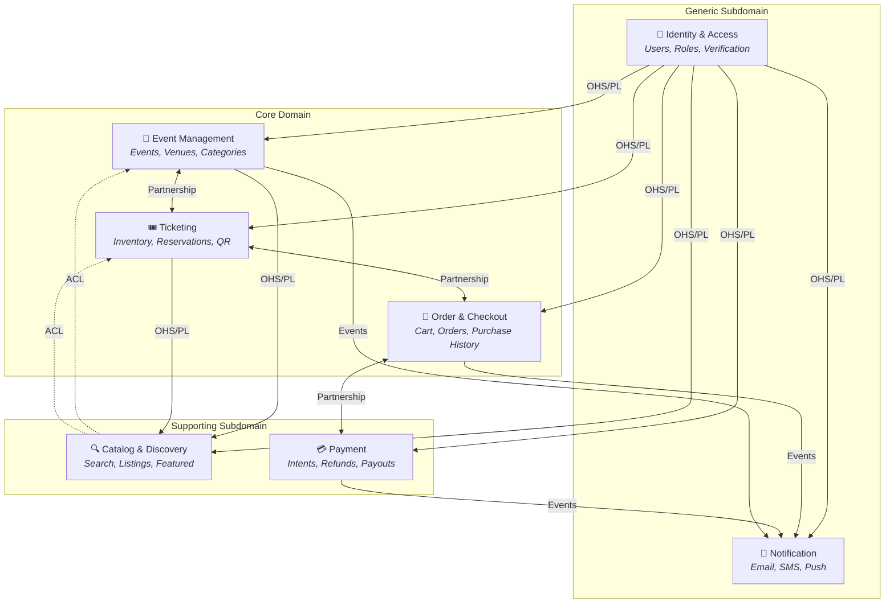

# Bounded Context Map (DDD)

## Overview

This diagram shows the 7 bounded contexts of EventPass, grouped by domain type (Core, Supporting, Generic), with arrows indicating upstream/downstream relationships and labeled integration patterns. It reflects the domain decomposition defined in [proposals/02-bounded-contexts.md](../proposals/02-bounded-contexts.md).

## Diagram

## Legend

| Pattern | Arrow Style | Description |
|---------|-------------|-------------|
| **OHS/PL** | Solid → | Open Host Service / Published Language — upstream exposes a stable, documented public API that downstream consumes directly |
| **Partnership** | Solid ↔ | Both contexts collaborate closely with a shared protocol; changes are coordinated between teams |
| **ACL** | Dashed → | Anti-Corruption Layer — downstream translates upstream data into its own internal model |
| **Events** | Solid → | Asynchronous event-driven communication via the internal event bus |

## Explanation

The context map reveals three distinct interaction patterns within EventPass:

### Identity as Universal Upstream

**Identity & Access** is the only context with no upstream dependencies — it is the source of truth for user identity and roles across the entire platform. All 6 other contexts consume its published API (OHS/PL) to resolve user information, validate permissions, and check organizer verification status. This makes Identity the most critical context for system availability — if it fails, no other context can authenticate requests.

### Core Domain Partnership Triangle

The three Core Domain contexts — **Event Management**, **Ticketing**, and **Order & Checkout** — form a tightly coupled partnership triangle:

- **Event Management ↔ Ticketing:** When an organizer creates an event, the Ticketing context needs event details (capacity, dates) to configure ticket types. When an event is cancelled, Ticketing must cancel all associated tickets. This bidirectional dependency requires coordinated changes — both contexts must agree on event lifecycle states.
- **Ticketing ↔ Order & Checkout:** The ticket purchase flow is the tightest coupling in the system. Orders creates reservations via Ticketing, and Ticketing marks tickets as SOLD when Orders confirms. The 10-minute reservation TTL creates a temporal dependency between the two contexts.
- **Order & Checkout ↔ Payment:** Orders initiates payment intents and reacts to payment outcomes. Payment processes refunds requested by Orders. This partnership requires consistent state management — an order cannot be confirmed until payment succeeds.

### Supporting Contexts as Consumers

- **Catalog & Discovery** is a read-only consumer. It builds denormalized views from events published by Event Management and inventory updates from Ticketing. The ACL pattern (dashed arrows) protects Catalog from upstream data model changes — it transforms domain events into its own optimized read model.
- **Payment** wraps the Stripe external API behind an ACL and publishes financial events (`PaymentSucceeded`, `RefundCompleted`) consumed by Orders and Notification.

### Notification as Terminal Consumer

**Notification** is the only context with no downstream dependents — it is a terminal event consumer. It subscribes to events from Event Management, Order & Checkout, and Payment, translating domain events into user-facing messages via SendGrid and Twilio. This isolation means the Notification context can be replaced or upgraded without affecting any other part of the system.

### Domain Type Distribution

| Type | Contexts | Significance |
|------|----------|-------------|
| **Core Domain** (3) | Event Management, Ticketing, Order & Checkout | Competitive advantage — unique business logic that differentiates EventPass |
| **Supporting Subdomain** (2) | Catalog & Discovery, Payment | Necessary but not unique — search and payments are common platform capabilities |
| **Generic Subdomain** (2) | Identity & Access, Notification | Commodity — could be replaced with off-the-shelf solutions (Auth0, SendGrid) |
