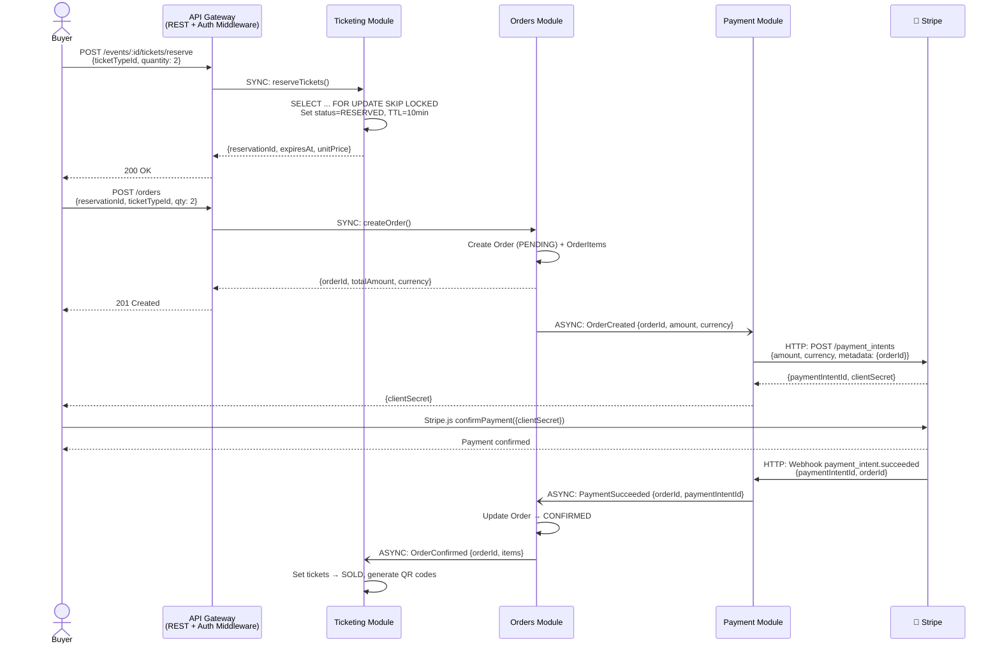
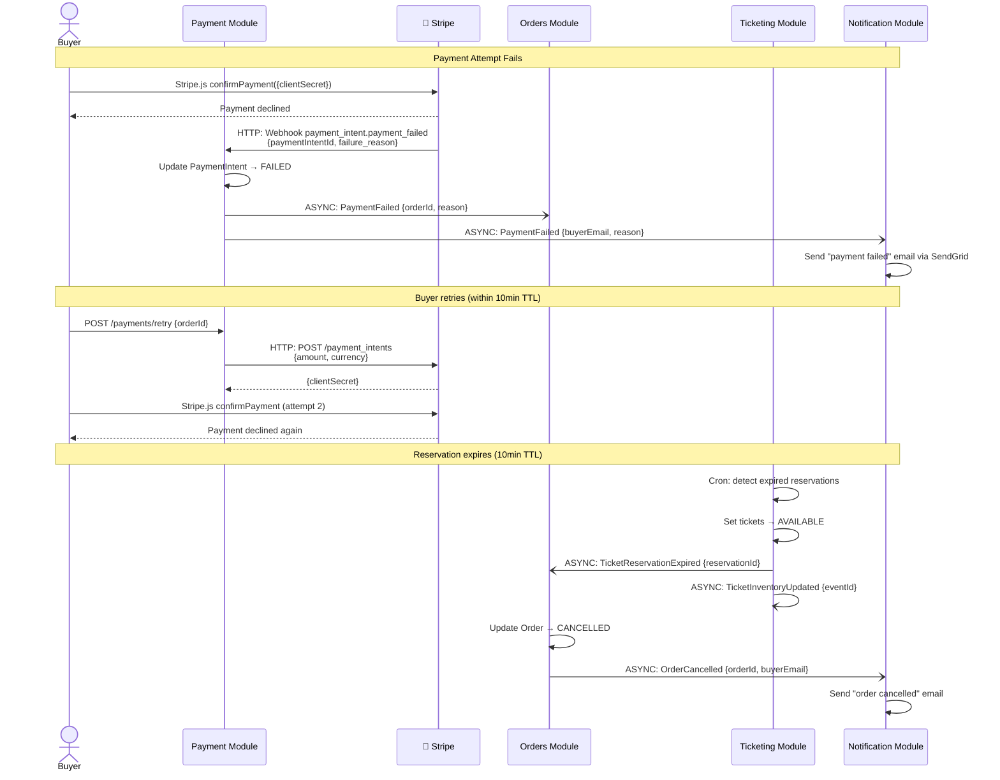
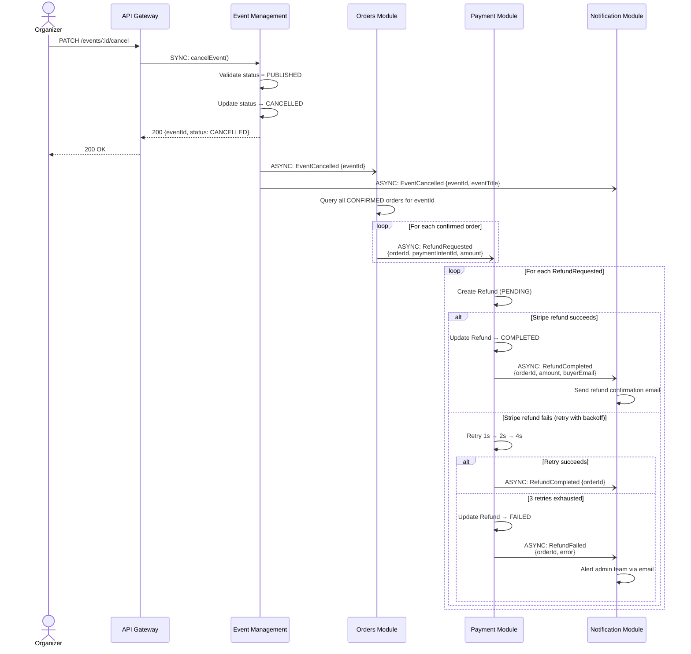

# Data Flow Diagrams

## Overview

Three sequence diagrams illustrating EventPass's critical data flows. Each diagram uses a maximum of 6 participants, with labeled arrows showing protocol (SYNC/ASYNC/HTTP) and payload. These diagrams are consistent with the flows defined in [proposals/04-data-flow-and-interactions.md](../proposals/04-data-flow-and-interactions.md) and the architectural decisions in the ADRs.

---

## 1. Ticket Purchase — Happy Path

This is the core transaction of EventPass: a buyer discovers an event, reserves tickets, pays, and receives a confirmation with QR codes.

### Explanation

The ticket purchase flow involves 5 internal components and 1 external system, coordinated through a mix of synchronous calls (reservation, order creation) and asynchronous events (payment processing, ticket finalization).

**Key design decisions reflected:**
- **Reservation uses `SELECT ... FOR UPDATE SKIP LOCKED`** (ADR-003) — concurrent buyers competing for the same tickets during flash sales get non-blocking behavior. If tickets are locked by another transaction, the query skips them rather than waiting, giving immediate feedback.
- **Order creation is synchronous** (ADR-002) — the buyer needs an immediate orderId to proceed to payment. The subsequent payment processing is asynchronous because it depends on Stripe's webhook timeline.
- **Stripe webhook triggers the confirmation chain** — the Payment module receives the webhook, publishes `PaymentSucceeded`, and the Orders and Ticketing modules react asynchronously. This decouples payment confirmation from order/ticket updates.

---

## 2. Ticket Purchase — Payment Failure

This diagram shows the failure path when a buyer's payment is declined and the reservation eventually expires.

### Explanation

The failure path demonstrates EventPass's resilience strategy for payment failures:

1. **Immediate notification** — When Stripe's webhook reports a payment failure, the buyer is notified via email immediately. The order remains in PENDING status, allowing retries.
2. **Retry within TTL** — The buyer can retry payment as long as the 10-minute reservation TTL has not expired. Each retry creates a new Stripe PaymentIntent.
3. **Automatic cleanup** — A background cron job in the Ticketing module detects expired reservations and releases the tickets back to the available pool. This ensures inventory is not permanently locked by abandoned checkout flows.
4. **Eventual consistency** — The `TicketReservationExpired` event triggers order cancellation in the Orders module, which in turn triggers a cancellation notification. The entire cleanup happens asynchronously without blocking any user-facing operation.

**Consistency guarantee:** The 10-minute TTL is the maximum time tickets can be held without a confirmed payment. This protects the system from inventory starvation during flash sales where thousands of buyers may start checkout but not all complete payment.

---

## 3. Event Cancellation & Mass Refund

This diagram shows the most operationally complex flow: an organizer cancels an event and all buyers with confirmed orders receive refunds.

### Explanation

Event cancellation triggers a cascade of operations across 4 bounded contexts:

1. **Synchronous cancellation** — The organizer's request is validated and processed synchronously. The Event Management module checks that the event is in a cancellable state (PUBLISHED, not already CANCELLED or COMPLETED) and updates it atomically.
2. **Async fan-out** — `EventCancelled` is published once and consumed by Orders (to initiate refunds) and Notification (to alert affected buyers). The Ticketing module also consumes this event to cancel all tickets (shown in the context map but simplified here to keep within 6 participants).
3. **Batch refund processing** — Orders queries all confirmed orders for the cancelled event and publishes a `RefundRequested` event for each one. This batch approach allows the Payment module to process refunds at its own pace without blocking the organizer's response.
4. **Exponential backoff for Stripe failures** — If a refund call to Stripe fails (network timeout, rate limit, insufficient balance), the Payment module retries with exponential backoff (1s, 2s, 4s). After 3 failures, the refund is marked as FAILED and an admin is alerted for manual resolution.

**Scale consideration:** For a large event with 2,000 confirmed orders, this flow generates 2,000 `RefundRequested` events. RabbitMQ (ADR-004) handles this volume comfortably (~1K events/min). The Payment module processes refunds concurrently (limited to Stripe's rate limit of 100 requests/sec), completing all refunds in approximately 20 seconds.

---

## Event Flow Summary

| Flow | Events in Chain | Sync Steps | Async Steps | External Calls |
|------|----------------|------------|-------------|----------------|
| Ticket Purchase (happy) | OrderCreated → PaymentSucceeded → OrderConfirmed | 2 (reserve, create order) | 3 (payment, confirm, ticket update) | 2 (Stripe create + webhook) |
| Ticket Purchase (failure) | PaymentFailed → TicketReservationExpired → OrderCancelled | 0 (all cleanup is async) | 4 (fail, notify, expire, cancel) | 1 (Stripe webhook) |
| Event Cancellation | EventCancelled → RefundRequested(×N) → RefundCompleted(×N) | 1 (cancel event) | 2+N (fan-out + per-order refund) | N (Stripe refund per order) |
