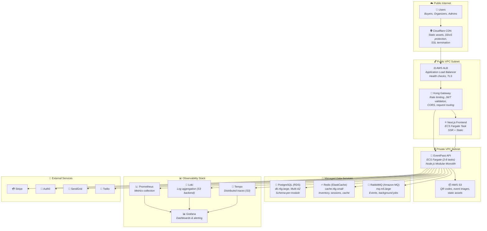

# Deployment Diagram

## Overview

This diagram shows EventPass's infrastructure topology across four network zones: Public Internet, Public VPC, Private VPC, and Managed/External Services. It reflects the deployment decisions in ADR-009 (ECS Fargate), ADR-003 (PostgreSQL), ADR-004 (RabbitMQ), ADR-008 (Redis), and ADR-006 (Grafana stack).

## Diagram

## Explanation

### Network Zones

The deployment is organized into four isolation layers:

**Public Internet** — User traffic enters through Cloudflare CDN, which serves cached static assets (JavaScript bundles, images, fonts) and proxies dynamic requests to the AWS infrastructure. Cloudflare also provides DDoS protection and SSL termination for the `eventpass.com` domain.

**Public VPC Subnet** — The AWS Application Load Balancer (ALB) receives traffic from Cloudflare and routes it to **Kong Gateway**, the API Gateway layer. Kong enforces rate limiting (critical for flash sales — 10 reservation attempts per user per minute), validates JWT tokens from Auth0, applies CORS headers, and routes requests to the appropriate backend: the Next.js frontend (SSR pages) or the EventPass API (ECS Fargate tasks). The ALB performs health checks (`/health` endpoint every 30s) and handles TLS termination for internal AWS traffic.

**Private VPC Subnet** — The EventPass API (Modular Monolith) runs on ECS Fargate with 2-8 tasks depending on load. During normal operation, 2 tasks handle ~500 concurrent users. During flash sales, auto-scaling increases to 8 tasks to handle ~5K concurrent users. The API has no direct internet exposure — all traffic flows through the ALB. AWS S3 stores QR code images, event poster images, and static assets uploaded by organizers.

**Managed Data Services** — All stateful components are managed AWS services for operational simplicity:
- **PostgreSQL (RDS):** `db.r6g.large` instance with Multi-AZ deployment for automatic failover. Schema-per-module isolation (ADR-003). Automated backups with 7-day retention and point-in-time recovery.
- **Redis (ElastiCache):** `cache.t4g.small` instance for ticket inventory caching (5s TTL), user sessions, and search result caching (ADR-008).
- **RabbitMQ (Amazon MQ):** `mq.m5.large` broker for durable event processing, background jobs, and dead-letter queues (ADR-004).

### Observability Stack (ADR-006)

The observability components run as ECS tasks alongside the application:
- **Prometheus** scrapes the `/metrics` endpoint from each EventPass API task every 15s.
- **Loki** receives structured logs (JSON format via Pino logger) from the application, stored on S3.
- **Tempo** collects distributed traces via OpenTelemetry, stored on S3.
- **Grafana** provides unified dashboards connecting all three data sources, with alerting to Slack and PagerDuty.

### External Service Communication

All external services are accessed from the Private VPC via NAT Gateway (not shown for diagram simplicity). Outbound HTTPS connections reach Stripe (payment processing), Auth0 (JWT validation), SendGrid (emails), and Twilio (SMS). Stripe's payment webhooks are the only inbound external communication — they arrive through Cloudflare → ALB → ECS at the `/webhooks/stripe` endpoint.

### Scaling Strategy

| Component | Normal (500 users) | Flash Sale (5K users) | Scaling Trigger |
|-----------|--------------------|-----------------------|----------------|
| ECS API Tasks | 2 | 8 | CPU > 70% |
| ECS Frontend Tasks | 1 | 2 | CPU > 70% |
| RDS PostgreSQL | db.r6g.large | db.r6g.large (same) | Vertical if needed |
| ElastiCache Redis | cache.t4g.small | cache.t4g.small (same) | Memory > 80% |
| Amazon MQ | mq.m5.large | mq.m5.large (same) | Queue depth alert |

### Estimated Monthly Cost (Normal Operation)

| Component | Instance/Config | Estimated Cost |
|-----------|----------------|---------------|
| ECS Fargate (API + Frontend) | 2 API tasks + 1 frontend task | ~$40/month |
| Kong Gateway (ECS task) | 0.25 vCPU, 0.5GB | ~$15/month |
| RDS PostgreSQL | db.r6g.large, Multi-AZ | ~$200/month |
| ElastiCache Redis | cache.t4g.small | ~$25/month |
| Amazon MQ RabbitMQ | mq.m5.large | ~$90/month |
| S3 + CloudWatch | Storage + monitoring | ~$20/month |
| Cloudflare Pro | CDN + DDoS protection | ~$20/month |
| Auth0 | Up to 25K MAU | Free |
| SendGrid | Up to 100 emails/day | Free |
| **Total** | | **~$410/month** |
