# Architecture Characteristics Analysis

Applying Mark Richards' Architecture Characteristics Worksheet and Architecture Styles Worksheet to formally justify EventPass's architectural decisions. This analysis provides the quantitative foundation for the architectural style selection documented in [01-high-level-architecture.md](01-high-level-architecture.md) and [ADR-001](../adrs/ADR-001-deployment-model.md).

> **Reference:** "First Law of Software Architecture — Everything in architecture is a trade-off." (Fundamentals of Software Architecture, Richards & Ford)

---

## 1. Architecture Characteristics Worksheet

### Top 3 Driving Characteristics (Explicit from the Domain)

#### 1. Elasticity

Flash sales generate traffic spikes of 10x–100x over the baseline. Unlike **scalability** (gradual, predictable growth), **elasticity** is the ability to scale up and scale down rapidly in response to sudden demand spikes. EventPass must handle thousands of users competing for limited inventory within windows of minutes.

- **Normal operation:** ~500 concurrent users browsing events.
- **Flash sale:** ~5,000 concurrent users hitting the reservation endpoint simultaneously.
- **Spike duration:** 5–15 minutes per flash sale event.
- **Requirement:** The system must absorb the spike without rejecting legitimate requests or overselling tickets.
- **Mitigation strategy:** Redis atomic DECR for inventory checks (sub-ms), ECS Fargate auto-scaling (2→8 tasks in ~90s), Kong rate limiting (10 req/user/min on reservation endpoint).

#### 2. Availability

The platform must be available 24/7 for ticket purchases. An outage during a flash sale window directly impacts revenue and user trust.

- **Target:** 99.9% uptime (≤8.76 hours downtime/year).
- **Availability tactics (from course material):**
  - *Detect faults:* Prometheus heartbeat/health checks (ping/echo every 15s), Grafana alerting, Tempo distributed tracing for latency anomalies.
  - *Recover from faults:* ECS auto-restart on health check failure (redundancy), blue-green deployment (rollback within 5 minutes), RabbitMQ DLQ + exponential backoff retry.
  - *Prevent faults:* PostgreSQL ACID transactions (prevents data corruption), input validation at API Gateway (exception prevention), Kong rate limiting during flash sales (overload prevention).
- **MTBF target:** >720 hours (30 days between failures).
- **MTTR target:** <15 minutes (automated recovery via ECS health checks + blue-green rollback).

#### 3. Data Integrity / Consistency

EventPass cannot sell more tickets than available (overselling). Financial transactions require ACID consistency. Refunds must be idempotent — processing the same refund request twice must not double-credit the buyer.

- **Inventory integrity:** `SELECT ... FOR UPDATE SKIP LOCKED` in PostgreSQL ensures concurrent transactions don't overbook the same tickets. Redis atomic DECR provides a fast pre-check layer before hitting the database.
- **Financial integrity:** Stripe PaymentIntents with idempotency keys (`order:{orderId}:attempt:{n}`) prevent duplicate charges. Refund operations check idempotency key before issuing a new Stripe refund.
- **Order state integrity:** The order lifecycle (PENDING → CONFIRMED → CANCELLED → REFUNDED) is enforced by the Order module's state machine. Invalid transitions are rejected at the domain level.

### Implicit Characteristics (Non-negotiable but Not Differentiating)

| Characteristic | Why Non-negotiable | How Addressed |
|---|---|---|
| **Security** | PCI compliance for payments, personal data protection, role-based access | PCI delegated to Stripe Elements (SAQ-A), Auth0 manages authentication/MFA, RBAC via JWT claims |
| **Feasibility** | Team of 3–5 devs, startup budget (~$410/month), MVP timeline | Modular Monolith avoids microservices overhead, managed services (RDS, ElastiCache, Amazon MQ) reduce ops burden |
| **Observability** | Must detect flash sale issues in minutes, not hours | Grafana + Prometheus + Loki + Tempo stack with SLO dashboards and PagerDuty alerting |
| **Maintainability** | Domain still in discovery — bounded context boundaries may shift | Module boundaries enforced by ESLint + schema isolation, allowing safe refactoring. Module extraction path pre-designed |

### Composite Characteristics (from Course Material)

**Agility** = Maintainability + Testability + Deployability

EventPass is in MVP phase where rapid iteration is critical. The team must be able to change domain logic, run tests, and deploy within hours — not days. Agility is a first-class concern that influences the choice of deployment model and CI/CD strategy.

**Reliability** = Availability + Testability + Data Integrity + Fault Tolerance

For payment and ticketing operations, reliability is mission-critical. A dropped payment confirmation or a double-sold ticket erodes user trust permanently. Reliability is achieved through ACID transactions, idempotency patterns, and automated health monitoring.

---

## 2. Architecture Styles Worksheet

Scoring each candidate architecture style against EventPass's driving and implicit characteristics on a 1–5 star scale:

| Characteristic | Layered | Modular Monolith | Microservices | Event-Driven | Space-Based |
|---|---|---|---|---|---|
| **Elasticity** | ★☆☆☆☆ | ★★☆☆☆ | ★★★★★ | ★★★☆☆ | ★★★★★ |
| **Availability** | ★☆☆☆☆ | ★★★☆☆ | ★★★★★ | ★★★☆☆ | ★★★★★ |
| **Data Integrity** | ★★★★★ | ★★★★☆ | ★★☆☆☆ | ★★☆☆☆ | ★☆☆☆☆ |
| **Feasibility** (cost + simplicity) | ★★★★★ | ★★★★☆ | ★☆☆☆☆ | ★★☆☆☆ | ★☆☆☆☆ |
| **Maintainability** | ★☆☆☆☆ | ★★★★☆ | ★★★☆☆ | ★★★☆☆ | ★★☆☆☆ |
| **Testability** | ★★☆☆☆ | ★★★★☆ | ★★★★☆ | ★★☆☆☆ | ★★☆☆☆ |
| **Deployability** | ★☆☆☆☆ | ★★★☆☆ | ★★★★★ | ★★★☆☆ | ★★★☆☆ |
| **Weighted Total** | **16** | **25** | **25** | **18** | **19** |

> **Weighted scoring:** Driving characteristics (Elasticity, Availability, Data Integrity) weighted 2x. Implicit characteristics weighted 1x.

### Style-by-Style Analysis

**Layered Architecture** — Traditional N-tier (presentation → business → persistence). Simple to understand, excellent data integrity through co-located transactions. However, rigid layering inhibits modularity, horizontal scaling requires scaling the entire tier, and deployability is poor (any change requires full redeployment with no module boundaries). **Rejected:** Too rigid for a domain still in discovery; no module isolation path.

**Modular Monolith** — Single deployable with strict internal module boundaries. Strong data integrity (★★★★) through in-process ACID transactions. Feasibility (★★★★) is excellent for a small team. Elasticity (★★) is limited to scaling the entire application, mitigated by Redis caching + ECS auto-scaling. Maintainability (★★★★) benefits from clean module boundaries with ESLint enforcement. **Selected:** Best overall balance for EventPass's constraints.

**Microservices** — Independent services per bounded context. Maximum elasticity (★★★★★) and availability (★★★★★), but data integrity drops to (★★) due to distributed transactions requiring saga patterns. Feasibility (★) is poor for a 3–5 person team managing 7 services. The tied weighted score (25) breaks in favor of Modular Monolith because data integrity is a hard requirement (ticket overselling is unacceptable), while elasticity can be mitigated at ★★ level through caching and auto-scaling.

**Event-Driven Architecture** — Asynchronous event processing with brokers. Good for decoupling but weak data integrity (★★) in purely async systems — maintaining consistent inventory counts requires synchronous checkpoints. Feasibility (★★) is moderate due to the complexity of event choreography and eventual consistency debugging. **Rejected:** EventPass's checkout flow requires synchronous inventory confirmation.

**Space-Based Architecture** — In-memory data grids with replication. Maximum elasticity (★★★★★) but worst data integrity (★) — eventual consistency between processing units makes ticket inventory control unreliable. Extremely high operational complexity and cost. **Rejected:** Fundamentally incompatible with ticket inventory's strong consistency requirement.

### Conclusion

The **Modular Monolith** offers the best balance for EventPass:

- **Data Integrity (★★★★)** — In-process ACID transactions protect ticket inventory and financial operations. This is the non-negotiable requirement.
- **Feasibility (★★★★)** — A 3–5 dev team can effectively build and operate a single deployable application.
- **Maintainability (★★★★)** — Clean module boundaries with ESLint enforcement and schema-per-module isolation allow safe refactoring as the domain evolves.
- **Elasticity (★★)** — The weakest score, mitigated by three layers: Redis atomic DECR (sub-ms inventory checks), PostgreSQL SKIP LOCKED (concurrent reservation processing), and ECS auto-scaling (2→8 tasks within 90 seconds).

Microservices ties on weighted total (25) but loses on the **one requirement that has zero tolerance for failure:** data integrity. Overselling even a single ticket in a flash sale is a business-critical failure. The consistency guarantees of in-process ACID transactions outweigh the elasticity advantages of independent service scaling at EventPass's current scale (~5K concurrent users).

---

## 3. Architectural Style vs. Patterns (Course Distinction)

A core teaching of the Fundamentals of Software Architecture course is the distinction between **styles** (the overall structural topology of the system) and **patterns** (reusable solutions to specific problems within the style).

### Style Chosen

**Modular Monolith** — The overall structural approach: a single deployable unit composed of internally isolated modules with explicit boundaries, each mapping to a DDD bounded context.

### Patterns Applied Within the Style

| Pattern | Where Applied | Why |
|---------|---------------|-----|
| **Event-Driven** | Internal event bus for inter-module side-effects | Decouples modules: `OrderConfirmed` triggers ticket updates and notifications without the Order module knowing about Ticketing or Notification internals |
| **CQRS-lite** | Catalog & Discovery module | Catalog is a projected read model built from `EventPublished` and `TicketInventoryUpdated` events. It is optimized for search (PostgreSQL tsvector + GIN index) while the source-of-truth lives in Event Management and Ticketing |
| **Cache-Aside** | Ticket inventory in Redis | Redis stores a fast-access copy of available ticket counts. On read: check cache first, fall back to database. On write: invalidate cache after database update. Flash sale optimization: Redis atomic DECR rejects oversold requests before they reach PostgreSQL |
| **Anti-Corruption Layer (ACL)** | Payment (Stripe), Notification (SendGrid, Twilio), Identity (Auth0) | External API types and contracts never leak into domain modules. Each integration is wrapped in an adapter that translates between the external API model and EventPass's internal domain model |
| **Saga (Choreography)** | Ticket purchase flow | The purchase flow spans Ticketing → Orders → Payment → Notification via domain events. Each module reacts to events and publishes its own. Compensation: `PaymentFailed` triggers `OrderCancelled`, which triggers `TicketReservationReleased` |
| **Strangler Fig (Future)** | Module extraction path | When a module needs independent scaling, it can be extracted behind an API boundary, with the in-process event bus replaced by RabbitMQ for that specific module — incrementally, without rewriting the entire system |

### Why This Matters

The Modular Monolith is not a "simple" architecture — it is a **deliberate** architectural style that incorporates sophisticated patterns internally. The Event-Driven pattern within the monolith provides the same decoupling benefits as microservice event choreography, but without network latency, distributed transactions, or operational overhead. The CQRS-lite pattern in Catalog & Discovery demonstrates that read/write separation is a pattern choice, not a style requirement — it can be applied within a monolith where it adds value.

---

## 4. Characteristic-to-Decision Traceability

Every architectural characteristic maps to concrete decisions documented across the repository:

| Characteristic | Architectural Decision | Document Reference |
|---|---|---|
| Elasticity | ECS Fargate auto-scaling (2→8 tasks), Redis atomic DECR, Kong rate limiting | [ADR-009](../adrs/ADR-009-deployment-cicd.md), [ADR-008](../adrs/ADR-008-caching-strategy.md), [01-api-gateway](../infrastructure/01-api-gateway.md) |
| Availability | Multi-AZ RDS, ECS health checks + blue-green deploy, RabbitMQ DLQ retry | [ADR-009](../adrs/ADR-009-deployment-cicd.md), [ADR-004](../adrs/ADR-004-event-bus.md), [06-primary-database](../infrastructure/06-primary-database.md) |
| Data Integrity | Schema-per-module PostgreSQL, SKIP LOCKED, Stripe idempotency keys | [ADR-003](../adrs/ADR-003-database-strategy.md), [ADR-008](../adrs/ADR-008-caching-strategy.md), [09-payment-provider](../infrastructure/09-payment-provider.md) |
| Security | Auth0 JWT + RBAC, Stripe Elements PCI SAQ-A, Kong JWT validation | [ADR-005](../adrs/ADR-005-authentication.md), [08-auth-provider](../infrastructure/08-auth-provider.md), [01-api-gateway](../infrastructure/01-api-gateway.md) |
| Feasibility | Modular Monolith (1 deploy), managed services (RDS, ElastiCache, Amazon MQ) | [ADR-001](../adrs/ADR-001-deployment-model.md), [04-deployment diagram](../diagrams/04-deployment.md) |
| Observability | Grafana + Prometheus + Loki + Tempo, SLO dashboards, PagerDuty alerts | [ADR-006](../adrs/ADR-006-observability.md), [11-observability-stack](../infrastructure/11-observability-stack.md) |
| Maintainability | ESLint boundary enforcement, schema isolation, internal event bus | [ADR-001](../adrs/ADR-001-deployment-model.md), [ADR-003](../adrs/ADR-003-database-strategy.md), [03-module-decomposition](03-service-module-decomposition.md) |

---

## 5. Radar Chart — Modular Monolith vs. Microservices

```mermaid
%%{init: {'theme': 'default'}}%%
xychart-beta
    title "Architecture Characteristics Comparison"
    x-axis ["Elasticity", "Availability", "Data Integrity", "Feasibility", "Maintainability", "Testability", "Deployability"]
    y-axis "Score (1-5)" 0 --> 5
    bar [2, 3, 4, 4, 4, 4, 3]
    bar [5, 5, 2, 1, 3, 4, 5]
```

> **Blue bars:** Modular Monolith. **Orange bars:** Microservices.
>
> The Modular Monolith's profile clusters in the 3–4 range across all characteristics — a balanced approach with no critical weaknesses. Microservices shows extreme variance: 5s in elasticity/availability/deployability but 1–2 in feasibility and data integrity. For EventPass's constraints (small team, ticket inventory integrity), the balanced profile is safer than the high-variance profile.
