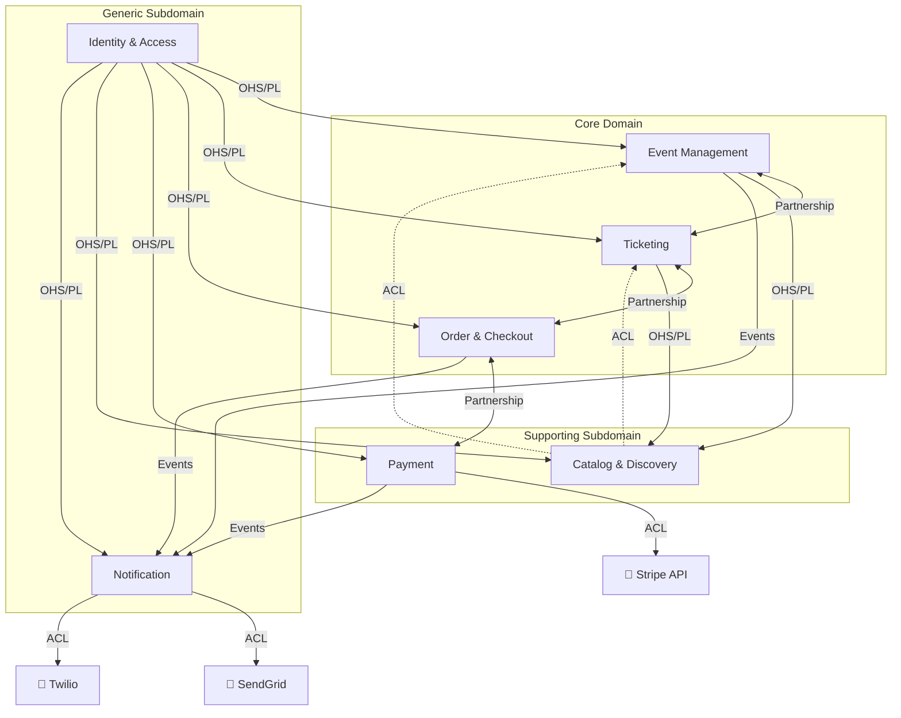

# Bounded Contexts Definition

## 1. Introduction

EventPass's domain is decomposed into **7 bounded contexts** following Domain-Driven Design principles. Each context encapsulates a distinct business capability, owns its data, and communicates with other contexts through well-defined integration patterns.

The contexts are classified by domain type:
- **Core Domain** (3): Event Management, Ticketing, Order & Checkout — these represent EventPass's competitive advantage and unique business logic.
- **Supporting Subdomain** (2): Catalog & Discovery, Payment — necessary for the platform to function but not unique to EventPass.
- **Generic Subdomain** (2): Identity & Access, Notification — commodity capabilities that could be replaced with off-the-shelf solutions.

---

## 2. Bounded Contexts

### 2.1 Identity & Access (Generic Subdomain)

**Purpose:** Manages user registration, authentication, authorization, and role lifecycle. Serves as the single source of truth for user identity across the platform.

#### Core Entities

**User**

| Field | Type | Constraints |
|-------|------|-------------|
| id | UUID | PK |
| email | string | UNIQUE, NOT NULL |
| passwordHash | string | NOT NULL |
| role | enum | [BUYER, ORGANIZER, ADMIN] |
| status | enum | [ACTIVE, SUSPENDED] |
| createdAt | timestamp | NOT NULL, DEFAULT now() |

**Profile**

| Field | Type | Constraints |
|-------|------|-------------|
| id | UUID | PK |
| userId | UUID | FK → User.id, UNIQUE |
| displayName | string | NOT NULL |
| avatarUrl | string | nullable |

**OrganizerVerification**

| Field | Type | Constraints |
|-------|------|-------------|
| id | UUID | PK |
| userId | UUID | FK → User.id |
| businessName | string | NOT NULL |
| taxId | string | NOT NULL |
| status | enum | [PENDING, VERIFIED, REJECTED] |

#### Domain Events

| Published | Consumed |
|-----------|----------|
| `UserRegistered` | — (upstream-only context) |
| `UserVerified` | |
| `OrganizerApproved` | |
| `OrganizerRejected` | |

#### Context Relationships

| Direction | Context | Pattern |
|-----------|---------|---------|
| Downstream | All other contexts | OHS/PL (Open Host Service / Published Language) |

**Rationale:** Identity is a Generic Subdomain because authentication and authorization are well-understood problems with mature solutions (Auth0). It exposes a stable, published API that all other contexts consume without needing adaptation layers.

---

### 2.2 Event Management (Core Domain)

**Purpose:** Owns the lifecycle of events — creation, configuration, publication, and cancellation. Manages the relationship between organizers and their events, including venue and category configuration.

#### Core Entities

**Event**

| Field | Type | Constraints |
|-------|------|-------------|
| id | UUID | PK |
| organizerId | UUID | FK → User.id |
| title | string | NOT NULL |
| description | text | nullable |
| categoryId | UUID | FK → Category.id |
| venueId | UUID | FK → Venue.id |
| startsAt | timestamp | NOT NULL |
| endsAt | timestamp | NOT NULL, > startsAt |
| status | enum | [DRAFT, PUBLISHED, CANCELLED, COMPLETED] |
| maxCapacity | int | > 0 |

**Venue**

| Field | Type | Constraints |
|-------|------|-------------|
| id | UUID | PK |
| name | string | NOT NULL |
| address | string | NOT NULL |
| city | string | NOT NULL |
| country | string | NOT NULL |
| latitude | decimal | NOT NULL |
| longitude | decimal | NOT NULL |
| capacity | int | > 0 |

**Category**

| Field | Type | Constraints |
|-------|------|-------------|
| id | UUID | PK |
| name | string | UNIQUE, NOT NULL |
| slug | string | UNIQUE, NOT NULL |

#### Domain Events

| Published | Consumed |
|-----------|----------|
| `EventCreated` | `OrganizerApproved` (from Identity & Access) |
| `EventPublished` | |
| `EventCancelled` | |
| `EventCompleted` | |

#### Context Relationships

| Direction | Context | Pattern |
|-----------|---------|---------|
| Upstream | Identity & Access | Consumes via OHS/PL |
| Downstream | Catalog & Discovery | OHS/PL |
| Bidirectional | Ticketing | Partnership |

**Rationale:** Event Management is a Core Domain because the event lifecycle is central to EventPass's value proposition. The Partnership pattern with Ticketing reflects the tight coordination needed between event configuration (capacity, dates) and ticket type definitions.

---

### 2.3 Catalog & Discovery (Supporting Subdomain)

**Purpose:** Provides the public-facing read model for event browsing, search, and filtering. Maintains denormalized event listings optimized for query performance rather than transactional integrity.

#### Core Entities

**EventListing**

| Field | Type | Constraints |
|-------|------|-------------|
| id | UUID | PK |
| eventId | UUID | FK → Event.id |
| title | string | NOT NULL |
| category | string | NOT NULL |
| city | string | NOT NULL |
| startsAt | timestamp | NOT NULL |
| minPrice | decimal | >= 0 |
| maxPrice | decimal | >= minPrice |
| availableTickets | int | >= 0 |
| thumbnailUrl | string | nullable |

**SearchIndex**

| Field | Type | Constraints |
|-------|------|-------------|
| eventId | UUID | FK → Event.id |
| keywords | text[] | NOT NULL |
| location | point | NOT NULL |
| dateRange | tsrange | NOT NULL |

**FeaturedEvent**

| Field | Type | Constraints |
|-------|------|-------------|
| id | UUID | PK |
| eventListingId | UUID | FK → EventListing.id |
| priority | int | > 0 |
| startsAt | timestamp | NOT NULL |
| endsAt | timestamp | NOT NULL |

#### Domain Events

| Published | Consumed |
|-----------|----------|
| — (read model, no domain events) | `EventPublished` (from Event Management) |
| | `EventCancelled` (from Event Management) |
| | `TicketInventoryUpdated` (from Ticketing) |

#### Context Relationships

| Direction | Context | Pattern |
|-----------|---------|---------|
| Upstream | Event Management | ACL (Anti-Corruption Layer) |
| Upstream | Ticketing | ACL |
| Downstream | — (serves frontend directly) | — |

**Rationale:** Catalog is a Supporting Subdomain because search and discovery, while important for user experience, is not unique business logic. The ACL pattern protects this context from changes in upstream data models — it transforms domain events into its own denormalized format.

---

### 2.4 Ticketing (Core Domain)

**Purpose:** Manages ticket types, inventory, seat reservations, QR code generation, and ticket validation at event entry. Enforces inventory constraints and temporal reservation locks.

#### Core Entities

**TicketType**

| Field | Type | Constraints |
|-------|------|-------------|
| id | UUID | PK |
| eventId | UUID | FK → Event.id |
| name | string | NOT NULL |
| price | decimal | >= 0 |
| currency | enum | [USD, EUR, GTQ] |
| totalQuantity | int | > 0 |
| availableQuantity | int | >= 0 |
| salesStart | timestamp | NOT NULL |
| salesEnd | timestamp | NOT NULL, > salesStart |

**Ticket**

| Field | Type | Constraints |
|-------|------|-------------|
| id | UUID | PK |
| ticketTypeId | UUID | FK → TicketType.id |
| orderId | UUID | FK → Order.id, nullable |
| status | enum | [AVAILABLE, RESERVED, SOLD, CANCELLED, USED] |
| qrCode | string | UNIQUE, NOT NULL |
| reservedUntil | timestamp | nullable |

**SeatReservation**

| Field | Type | Constraints |
|-------|------|-------------|
| id | UUID | PK |
| ticketId | UUID | FK → Ticket.id |
| seatLabel | string | NOT NULL |
| expiresAt | timestamp | NOT NULL |

#### Domain Events

| Published | Consumed |
|-----------|----------|
| `TicketReserved` | `EventPublished` (from Event Management) |
| `TicketReservationExpired` | `EventCancelled` (from Event Management) |
| `TicketSold` | `OrderConfirmed` (from Order & Checkout) |
| `TicketCancelled` | `OrderCancelled` (from Order & Checkout) |
| `TicketInventoryUpdated` | |
| `TicketValidated` | |

#### Context Relationships

| Direction | Context | Pattern |
|-----------|---------|---------|
| Upstream | Event Management | Partnership |
| Upstream | Order & Checkout | Partnership |
| Downstream | Catalog & Discovery | OHS/PL |

**Rationale:** Ticketing is a Core Domain because inventory management with temporal locks and flash sale concurrency handling is the most technically challenging and business-critical part of EventPass. The Partnership pattern with both Event Management and Order & Checkout reflects the tight integration needed for the reservation-to-purchase flow.

---

### 2.5 Order & Checkout (Core Domain)

**Purpose:** Manages the cart, checkout process, order lifecycle, and purchase history. Coordinates the transaction flow between ticket reservation, payment processing, and order confirmation.

#### Core Entities

**Order**

| Field | Type | Constraints |
|-------|------|-------------|
| id | UUID | PK |
| buyerId | UUID | FK → User.id |
| status | enum | [PENDING, CONFIRMED, CANCELLED, REFUNDED] |
| totalAmount | decimal | > 0 |
| currency | enum | [USD, EUR, GTQ] |
| createdAt | timestamp | NOT NULL, DEFAULT now() |
| confirmedAt | timestamp | nullable |

**OrderItem**

| Field | Type | Constraints |
|-------|------|-------------|
| id | UUID | PK |
| orderId | UUID | FK → Order.id |
| ticketTypeId | UUID | FK → TicketType.id |
| quantity | int | > 0 |
| unitPrice | decimal | >= 0 |
| subtotal | decimal | quantity * unitPrice |

**Cart**

| Field | Type | Constraints |
|-------|------|-------------|
| id | UUID | PK |
| buyerId | UUID | FK → User.id, UNIQUE |
| expiresAt | timestamp | NOT NULL |
| items | OrderItem[] | NOT NULL |

#### Domain Events

| Published | Consumed |
|-----------|----------|
| `OrderCreated` | `TicketReserved` (from Ticketing) |
| `OrderConfirmed` | `TicketReservationExpired` (from Ticketing) |
| `OrderCancelled` | `PaymentSucceeded` (from Payment) |
| `RefundRequested` | `PaymentFailed` (from Payment) |

#### Context Relationships

| Direction | Context | Pattern |
|-----------|---------|---------|
| Upstream | Identity & Access | Consumes via OHS/PL |
| Bidirectional | Ticketing | Partnership |
| Bidirectional | Payment | Partnership |
| Downstream | Notification | Event publishing |

**Rationale:** Order & Checkout is a Core Domain because it orchestrates the central business transaction — the purchase. It coordinates between Ticketing (reservation) and Payment (charging) and must handle partial failures gracefully (e.g., payment fails after reservation is made).

---

### 2.6 Payment (Supporting Subdomain)

**Purpose:** Handles payment processing through Stripe, including payment intents, charges, refunds, and organizer payouts. Isolates the external payment provider behind an Anti-Corruption Layer.

#### Core Entities

**PaymentIntent**

| Field | Type | Constraints |
|-------|------|-------------|
| id | UUID | PK |
| orderId | UUID | FK → Order.id |
| amount | decimal | > 0 |
| currency | enum | [USD, EUR, GTQ] |
| stripePaymentIntentId | string | UNIQUE, NOT NULL |
| status | enum | [CREATED, PROCESSING, SUCCEEDED, FAILED, REFUNDED] |
| createdAt | timestamp | NOT NULL, DEFAULT now() |

**Refund**

| Field | Type | Constraints |
|-------|------|-------------|
| id | UUID | PK |
| paymentIntentId | UUID | FK → PaymentIntent.id |
| amount | decimal | > 0, <= PaymentIntent.amount |
| reason | string | NOT NULL |
| stripeRefundId | string | UNIQUE, NOT NULL |
| status | enum | [PENDING, COMPLETED, FAILED] |

**OrganizerPayout**

| Field | Type | Constraints |
|-------|------|-------------|
| id | UUID | PK |
| organizerId | UUID | FK → User.id |
| eventId | UUID | FK → Event.id |
| amount | decimal | > 0 |
| platformFee | decimal | >= 0 |
| stripeTransferId | string | UNIQUE, NOT NULL |
| status | enum | [PENDING, COMPLETED, FAILED] |

#### Domain Events

| Published | Consumed |
|-----------|----------|
| `PaymentSucceeded` | `OrderCreated` (from Order & Checkout) |
| `PaymentFailed` | `RefundRequested` (from Order & Checkout) |
| `RefundCompleted` | `EventCompleted` (from Event Management) |
| `PayoutCompleted` | |

#### Context Relationships

| Direction | Context | Pattern |
|-----------|---------|---------|
| Upstream | Order & Checkout | Partnership |
| Downstream | Notification | Event publishing |
| External | Stripe API | ACL (Anti-Corruption Layer) |

**Rationale:** Payment is a Supporting Subdomain because payment processing itself is not unique to EventPass — Stripe handles the complexity. However, the ACL pattern is critical: it shields EventPass's domain from Stripe's API design, versioning changes, and webhook format. If we switch from Stripe to another provider (e.g., Adyen), only this context changes.

---

### 2.7 Notification (Generic Subdomain)

**Purpose:** Delivers transactional communications to users across multiple channels (email, SMS, push). Consumes domain events from all other contexts and translates them into user-facing messages using templates.

#### Core Entities

**NotificationTemplate**

| Field | Type | Constraints |
|-------|------|-------------|
| id | UUID | PK |
| type | enum | [EMAIL, SMS, PUSH] |
| eventType | string | NOT NULL (maps to domain event name) |
| subject | string | nullable (only for EMAIL) |
| bodyTemplate | text | NOT NULL (supports variable interpolation) |

**NotificationLog**

| Field | Type | Constraints |
|-------|------|-------------|
| id | UUID | PK |
| recipientId | UUID | FK → User.id |
| channel | enum | [EMAIL, SMS, PUSH] |
| status | enum | [QUEUED, SENT, DELIVERED, FAILED] |
| sentAt | timestamp | nullable |
| error | string | nullable |

**NotificationPreference**

| Field | Type | Constraints |
|-------|------|-------------|
| id | UUID | PK |
| userId | UUID | FK → User.id |
| channel | enum | [EMAIL, SMS, PUSH] |
| enabled | boolean | DEFAULT true |

#### Domain Events

| Published | Consumed |
|-----------|----------|
| `NotificationSent` | `UserRegistered` (from Identity & Access) |
| `NotificationFailed` | `OrderConfirmed` (from Order & Checkout) |
| | `PaymentFailed` (from Payment) |
| | `EventCancelled` (from Event Management) |
| | `TicketValidated` (from Ticketing) |
| | `RefundCompleted` (from Payment) |

#### Context Relationships

| Direction | Context | Pattern |
|-----------|---------|---------|
| Upstream | All event-emitting contexts | ACL |
| Downstream | — (terminal context) | — |
| External | SendGrid (email), Twilio (SMS) | ACL |

**Rationale:** Notification is a Generic Subdomain — every platform needs notifications, and the logic is templated and event-driven. The ACL pattern isolates EventPass from SendGrid and Twilio API specifics. The context subscribes to a wide range of domain events but never influences business logic — it is purely reactive.

---

## 3. Context Map

The following diagram shows all 7 bounded contexts with their relationships and integration patterns.

### Context Map Legend

| Pattern | Description |
|---------|-------------|
| **OHS/PL** | Open Host Service / Published Language — the upstream context exposes a stable, well-documented API |
| **Partnership** | Both teams collaborate closely, sharing a common protocol and making changes together |
| **ACL** | Anti-Corruption Layer — the downstream context translates upstream data into its own model |
| **Events** | Event-driven communication via the internal event bus |
| **→** | Upstream → Downstream dependency |
| **↔** | Bidirectional partnership |
| **- - →** | Consumption via ACL (read-only, denormalized) |

---

## 4. Summary

| # | Bounded Context | Domain Type | Key Entities | Events Published | Integration |
|---|----------------|-------------|-------------|-----------------|-------------|
| 1 | Identity & Access | Generic | User, Profile, OrganizerVerification | 4 | OHS/PL (upstream to all) |
| 2 | Event Management | Core | Event, Venue, Category | 4 | Partnership (Ticketing), OHS/PL (Catalog) |
| 3 | Catalog & Discovery | Supporting | EventListing, SearchIndex, FeaturedEvent | 0 | ACL (consumes from EM, TK) |
| 4 | Ticketing | Core | TicketType, Ticket, SeatReservation | 6 | Partnership (EM, OC), OHS/PL (CD) |
| 5 | Order & Checkout | Core | Order, OrderItem, Cart | 4 | Partnership (TK, PM) |
| 6 | Payment | Supporting | PaymentIntent, Refund, OrganizerPayout | 4 | Partnership (OC), ACL (Stripe) |
| 7 | Notification | Generic | NotificationTemplate, NotificationLog, NotificationPreference | 2 | ACL (SendGrid, Twilio) |
