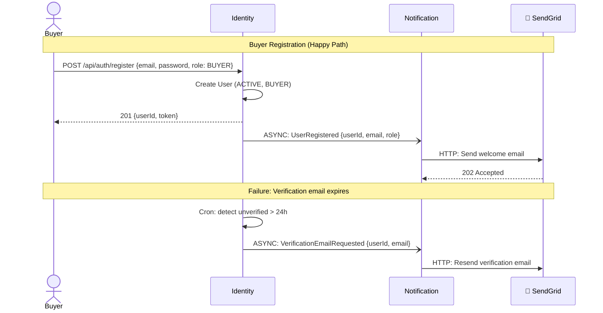
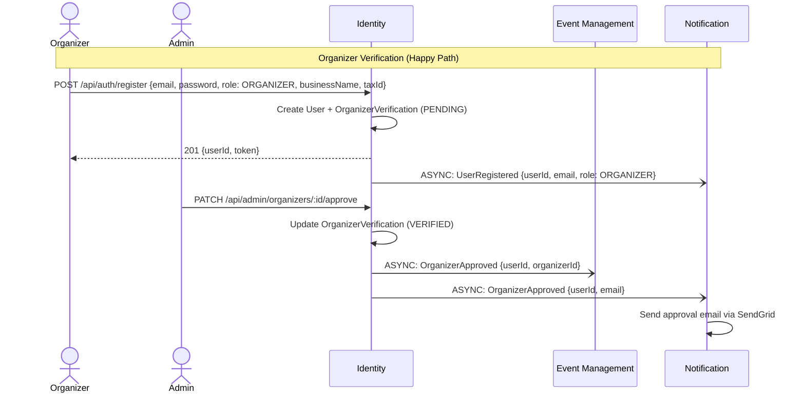
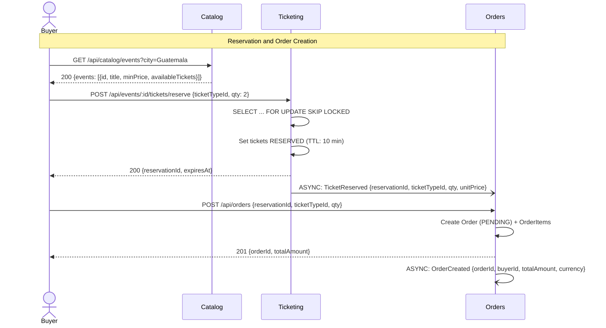
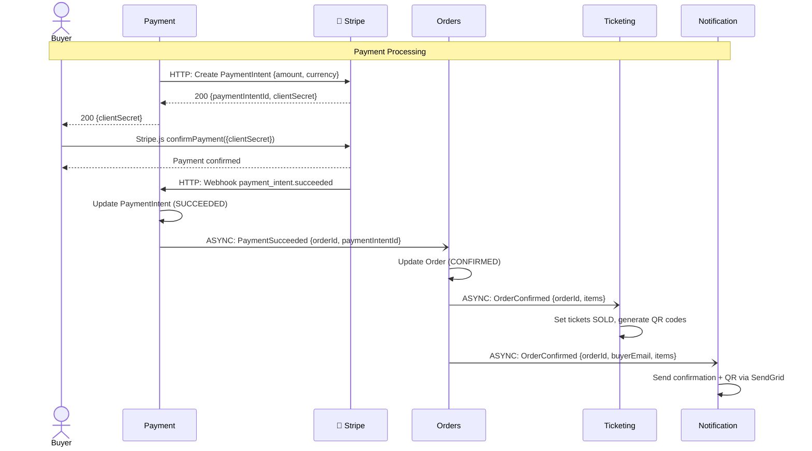
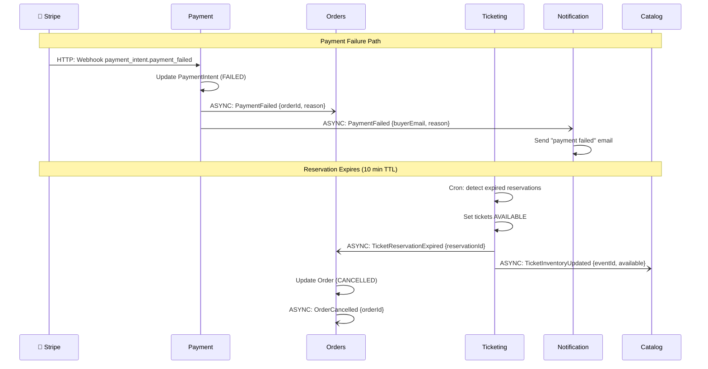
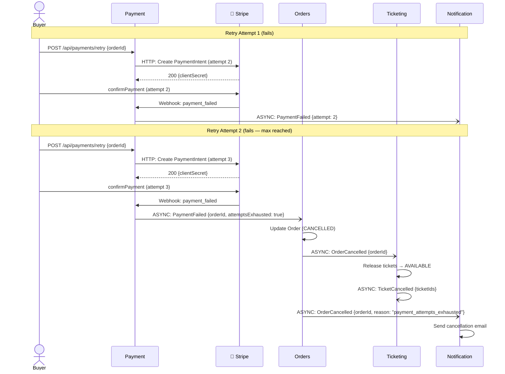
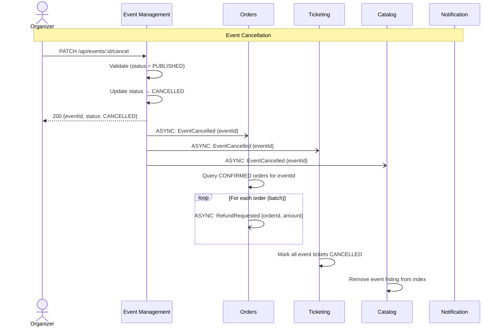
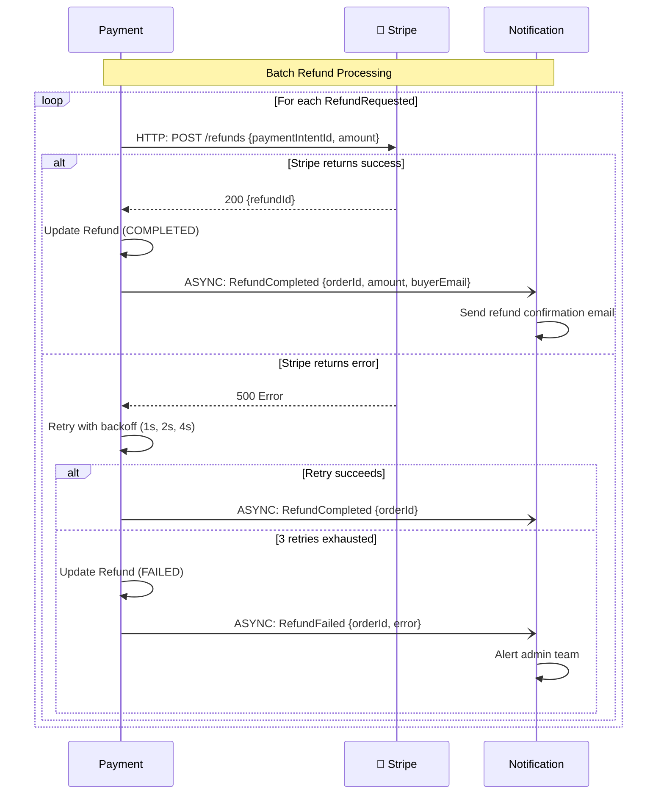

# Data Flow and Interactions

## 1. Introduction

This document describes four end-to-end flows through EventPass, showing how bounded contexts interact via synchronous calls (facade invocations) and asynchronous events (internal event bus). Each flow includes a happy path, at least one failure path, and a Mermaid sequence diagram.

All flows assume the Modular Monolith architecture where modules communicate in-process. Protocol labels indicate the type of interaction:

- **SYNC** — Direct facade method call (in-process, sub-millisecond)
- **ASYNC** — Domain event published on the internal event bus
- **HTTP** — External API call (Stripe, SendGrid, Twilio, Auth0)

---

## 2. Flow 1: User Registration and Organizer Verification

### 2.1 Happy Path

1. **Buyer registers** — submits email and password to the Identity module.
2. Identity creates the User (status: ACTIVE, role: BUYER) and publishes `UserRegistered`.
3. Notification module consumes `UserRegistered` and sends a welcome email via SendGrid.
4. **Organizer registers** — submits email, password, and business details.
5. Identity creates the User (role: ORGANIZER) and an OrganizerVerification (status: PENDING). Publishes `UserRegistered`.
6. Admin reviews the organizer application in the admin panel.
7. Admin approves — Identity updates OrganizerVerification (status: VERIFIED) and publishes `OrganizerApproved`.
8. Event Management consumes `OrganizerApproved` and enables event creation for this organizer.
9. Notification consumes `OrganizerApproved` and sends approval email.

### 2.2 Failure Path: Email Verification Timeout

1. User registers but does not verify their email within 24 hours.
2. A scheduled job in the Identity module detects expired unverified accounts.
3. Identity resends the verification email by publishing a `VerificationEmailRequested` event.
4. Notification consumes the event and sends the email via SendGrid.
5. If the user still does not verify after 72 hours, the account is marked as SUSPENDED.

### 2.3 Sequence Diagram

---

## 3. Flow 2: Ticket Purchase (Core Transaction)

This is EventPass's most critical flow. It involves 5 bounded contexts and must handle concurrent buyers competing for limited inventory during flash sales.

### 3.1 Happy Path

1. **Buyer browses events** — Catalog module serves search results from its denormalized read model.
2. **Buyer selects tickets** — Frontend sends ticket type and quantity to the Ticketing module.
3. **Ticketing creates a reservation** — Locks the requested tickets with a 10-minute TTL using `SELECT ... FOR UPDATE SKIP LOCKED`. Sets ticket status to RESERVED. Publishes `TicketReserved`.
4. **Buyer proceeds to checkout** — Frontend creates an order via the Orders module.
5. **Orders creates the order** (status: PENDING) with order items. Publishes `OrderCreated`.
6. **Payment module creates a Stripe PaymentIntent** — Consumes `OrderCreated`, calls Stripe API to create a payment intent, and returns the `client_secret` to the frontend.
7. **Buyer completes payment in the frontend** using Stripe Elements.
8. **Stripe sends webhook** — `payment_intent.succeeded` webhook hits the Payment module.
9. **Payment publishes `PaymentSucceeded`** with orderId and paymentIntentId.
10. **Orders confirms the order** — Consumes `PaymentSucceeded`, updates order status to CONFIRMED. Publishes `OrderConfirmed`.
11. **Ticketing marks tickets as SOLD** — Consumes `OrderConfirmed`, updates ticket status, generates QR codes. Publishes `TicketSold`.
12. **Notification sends confirmation email** — Consumes `OrderConfirmed`, sends email with order details and QR codes via SendGrid.

### 3.2 Failure Path: Payment Rejected

1. Steps 1-6 happen as in the happy path.
2. Stripe declines the payment — webhook `payment_intent.payment_failed` arrives.
3. Payment module publishes `PaymentFailed` with orderId and failure reason.
4. Orders module consumes `PaymentFailed` — keeps order in PENDING status (buyer may retry).
5. Ticketing module does NOT release the reservation yet (10-min TTL is still active).
6. Notification sends a "payment failed, please try again" email.
7. If the buyer does not retry within 10 minutes, the reservation TTL expires.
8. Ticketing detects expiration, updates ticket status to AVAILABLE, publishes `TicketReservationExpired`.
9. Orders consumes `TicketReservationExpired` and cancels the order. Publishes `OrderCancelled`.
10. Catalog consumes `TicketInventoryUpdated` and updates available ticket counts in the listing.

### 3.3 Sequence Diagrams

**Part 1: Reservation and Checkout**

**Part 2: Payment and Confirmation**

**Part 3: Payment Failure and Reservation Expiry**

---

## 4. Flow 3: Failed Payment Processing and Retry

This flow handles the case where a buyer's payment fails and they attempt to retry before the reservation expires.

### 4.1 Happy Path (Retry Succeeds)

1. Initial payment fails (as described in Flow 2 failure path).
2. Orders module keeps the order in PENDING status.
3. Buyer clicks "Retry Payment" in the frontend.
4. Payment module creates a new Stripe PaymentIntent for the same order.
5. Buyer completes payment successfully.
6. Flow continues from step 8 of Flow 2 happy path.

### 4.2 Failure Path: 3 Retries Exhausted

1. Payment fails on first attempt. Buyer is notified.
2. Buyer retries — second PaymentIntent created. Payment fails again.
3. Buyer retries — third PaymentIntent created. Payment fails a third time.
4. Payment module publishes `PaymentFailed` with `attemptsExhausted: true`.
5. Orders module auto-cancels the order. Publishes `OrderCancelled`.
6. Ticketing releases the reservation immediately (does not wait for TTL). Publishes `TicketCancelled`.
7. Notification sends "order cancelled after 3 failed payment attempts" email.

### 4.3 Sequence Diagram

---

## 5. Flow 4: Event Cancellation and Mass Refund

This flow handles the most operationally complex scenario: an organizer cancels an event and all existing orders must be refunded.

### 5.1 Happy Path

1. **Organizer requests cancellation** — calls Event Management module to cancel the event.
2. Event Management validates that the event can be cancelled (status is PUBLISHED, not already CANCELLED or COMPLETED). Updates event status to CANCELLED. Publishes `EventCancelled`.
3. **Orders module consumes `EventCancelled`** — queries all orders for this event with status CONFIRMED. For each order, publishes `RefundRequested`.
4. **Payment module processes refunds in batch** — For each `RefundRequested`, creates a Stripe Refund via the API. Publishes `RefundCompleted` for each successful refund.
5. **Ticketing consumes `EventCancelled`** — marks all tickets for this event as CANCELLED. Publishes `TicketCancelled` for each ticket.
6. **Notification consumes `RefundCompleted`** — sends refund confirmation email to each buyer.
7. **Catalog consumes `EventCancelled`** — removes the event listing from the search index.

### 5.2 Failure Path: Stripe Refund Fails

1. Steps 1-3 happen as in the happy path.
2. Payment module calls Stripe to process a refund — Stripe returns an error (e.g., network timeout, insufficient balance).
3. Payment module retries with **exponential backoff**: 1s, 2s, 4s (3 attempts total).
4. If all 3 retries fail, Payment publishes `RefundFailed` with the orderId and error details.
5. Notification consumes `RefundFailed` and alerts the admin team via email.
6. The failed refund is logged in the Payment module's `Refund` entity (status: FAILED) for manual resolution.
7. Admin resolves the issue manually (e.g., retries from the admin panel or contacts Stripe support).

### 5.3 Sequence Diagrams

**Part 1: Cancellation and Batch Refund Initiation**

**Part 2: Refund Processing with Retry**

---

## 6. Summary: Event Flow Matrix

This matrix shows which domain events connect which contexts across all four flows.

| Domain Event | Published By | Consumed By | Flow(s) |
|-------------|-------------|-------------|---------|
| `UserRegistered` | Identity | Notification | 1 |
| `OrganizerApproved` | Identity | Event Management, Notification | 1 |
| `VerificationEmailRequested` | Identity | Notification | 1 (failure) |
| `TicketReserved` | Ticketing | Orders | 2 |
| `TicketReservationExpired` | Ticketing | Orders, Catalog | 2 (failure) |
| `TicketSold` | Ticketing | — | 2 |
| `TicketCancelled` | Ticketing | — | 3, 4 |
| `TicketInventoryUpdated` | Ticketing | Catalog | 2 (failure) |
| `OrderCreated` | Orders | Payment | 2 |
| `OrderConfirmed` | Orders | Ticketing, Notification | 2 |
| `OrderCancelled` | Orders | Ticketing, Notification | 2 (failure), 3 |
| `RefundRequested` | Orders | Payment | 4 |
| `PaymentSucceeded` | Payment | Orders | 2 |
| `PaymentFailed` | Payment | Orders, Notification | 2 (failure), 3 |
| `RefundCompleted` | Payment | Notification | 4 |
| `RefundFailed` | Payment | Notification | 4 (failure) |
| `EventCancelled` | Event Management | Orders, Ticketing, Catalog, Notification | 4 |
